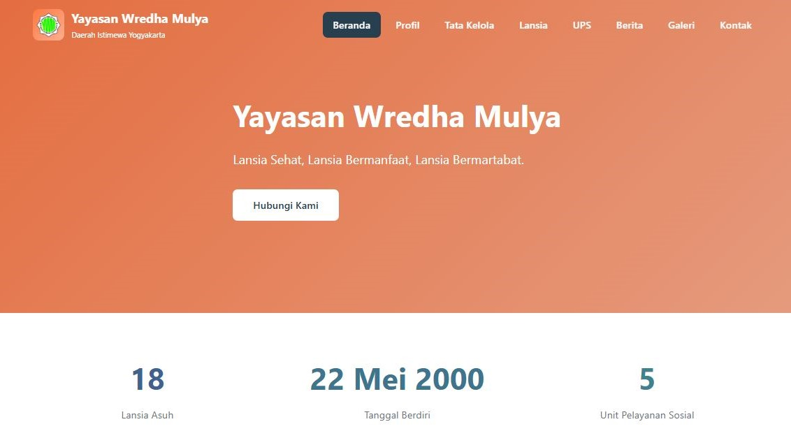

# **Yayasan Wredha Mulya Website**
`Official Profile & Information System for Elderly Social Services`

## 📌 Overview
Yayasan Wredha Mulya Website is an official web-based platform developed to support the digital presence of the foundation and improve accessibility of information related to elderly care services.

The system provides structured and well-organized content, allowing users to explore information about the foundation, its organizational structure, service units, activities, and documentation. The website is designed with a focus on simplicity, usability, and ease of management for administrators.

## 👨‍💻 Developed By
* `Ivan Roberto Halim`

## ⚙️ Features
* 🏠 Homepage  
* 🏢 Profile  
* 🧓 Elderly Management  
* 🏥 Social Service Units  
* 📰 News & Activities  
* 🖼️ Gallery  
* 📞 Contact & Location  

## 🧩 Core Modules
* `Custom Post Type (CPT)` → UPS, Organ Yayasan, Galeri, Data Lansia
* `Custom Taxonomy` → Kategori Galeri
* `Meta Box System` → Detail Data Lansia
* `Theme Customization` → Custom WordPress theme development
* `Asset Management` → CSS & JavaScript integration

## 🛠️ Tech Stack
* 💻 Web Development: `PHP (WordPress)`
* 🎨 Frontend: `HTML, CSS, JavaScript`
* 🗄️ Database: `MySQL`
* 🎯 Library: `Font Awesome`

## 🌐 Project Showcase
👉 Check out the website here:
https://yayasanwredhamulya.com

## 📄 Notes
This project was developed as a form of collaboration with Yayasan Wredha Mulya Yogyakarta, aiming to support their digital transformation and improve public access to information about elderly social services.
